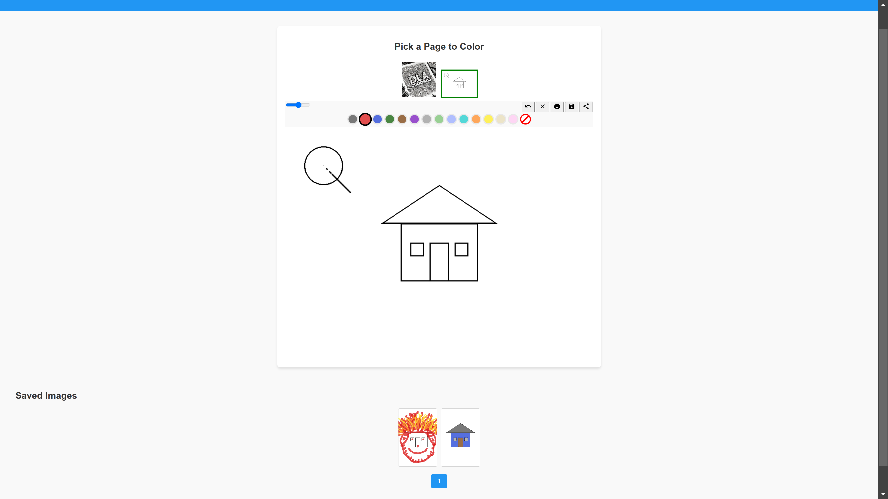

# YouSee-Sketch

**YouSee-Sketch** is a web-based coloring book application that allows users to select from a variety of images, color them using intuitive tools, and save or share their creations. Built with Flask for the backend and custom web components for the frontend, YouSee-Sketch offers a seamless and interactive experience for users when coloring or editing.



## Security Features

- Secure file upload handling with extension validation
- Filename sanitization to prevent path traversal attacks
- CSRF protection through Flask's built-in security
- Input validation and sanitization
- Secure file storage with unique timestamped filenames
- XSS protection through content security policies

## Table of Contents

- [Features](#features)
- [Usage](#usage)
- [Project Structure](#project-structure)
- [Technologies Used](#technologies-used)
- [Configuration](#configuration)
- [Running the Application](#running-the-application)
- [Security Considerations](#security-considerations)
- [Performance Optimizations](#performance-optimizations)
- [Browser Support](#browser-support)
- [Production Deployment](#production-deployment)
- [Contributing](#contributing)
- [License](#license)
- [Contact](#contact)

## Features

- **Image Selection:** Choose from a variety of predefined images to color
- **Drawing Tools:** Utilize different colors and brush sizes to create your masterpiece
- **Real-time Saving:** Automatic saving of work in progress
- **Share & Save:** Export your creations with secure server-side storage
- **Paginated Gallery:** View saved artwork with efficient loading
- **Responsive Design:** Works on desktop and mobile devices
- **Touch Support:** Full touch-screen compatibility
- **Offline Support:** Local storage for work in progress

## Usage

1. **Select an Image**
   - Browse through the thumbnails at the top of the page
   - Click on a thumbnail to select it for coloring

2. **Coloring**
   - Choose your desired color from the palette
   - Adjust the brush size using the slider
   - Click and drag on the image to apply color

3. **Save Your Work**
   - Click the **Save** button to upload your colored image to the server and download it locally

4. **Share Your Creation**
   - Click the **Share** button to upload your image to the server
   - If your browser supports the Web Share API, a share dialog will appear
   - If the Web Share API is not supported, a notification will notify you that the image has been saved

5. **View Saved Images**
   - Scroll down to the **Saved Images** section to view all saved creations as thumbnails

## Project Structure

```
YouSee-Sketch/
├── app.py                 # Main Flask application
├── requirements.txt       # Python dependencies
├── static/
│   ├── css/
│   │   └── style.css      # Main stylesheet
│   ├── images/            # Original coloring book images
│   │   └── test-page.png  # Test image
│   ├── js/
│   │   └── jl-coloringBook.js # Coloring book component
│   └── saved/             # User-saved colored images
└── templates/
    └── index.html         # Main application template
```

## Technologies Used

### Backend
- **Flask**: Web application framework
- **Werkzeug**: WSGI utilities and file handling

### Frontend
- **HTML5/CSS3**
- **JavaScript/jQuery**
- **Material Icons**

## Configuration

The application can be configured by modifying the following:

1. **Port Configuration**: Modify the port in `app.py` (default: 5000)
2. **Image Storage**: Saved images are stored in `static/saved/`
3. **New Images**: Add new coloring pages to `static/images/`
4. **PDF Conversion**: Use tools in `static/convert/` to convert PDFs to PNGs

## Running the Application

When you start the application, you'll see output similar to this:

```bash
$ python app.py
 * Serving Flask app 'app'
 * Debug mode: on
 * Running on http://0.0.0.0:5000 (Press CTRL+C to quit)
 * Restarting with stat
 * Debugger is active!
 * Debugger PIN: xxx-xxx-xxx
```

This indicates the application is running and accessible at the specified addresses on port 5000.

## Security Considerations

- Always run in production with HTTPS enabled
- Configure proper CORS headers in production
- Set up proper file permissions for upload directories
- Implement user authentication for production use
- Regular security updates for dependencies
- Monitor server logs for suspicious activity

## Performance Optimizations

- Image compression for uploads
- Client-side caching
- Lazy loading of gallery images
- Paginated data loading
- Optimized DOM updates
- Debounced save operations
- Efficient canvas rendering

## Browser Support

- Chrome/Edge (latest 2 versions)
- Firefox (latest 2 versions)
- Safari (latest 2 versions)
- Mobile browsers with touch support

## Production Deployment

1. Use a production WSGI server (e.g., Gunicorn)
2. Enable HTTPS using a reverse proxy
3. Configure proper CORS headers
4. Set up server monitoring
5. Implement proper logging
6. Configure backup systems
7. Set up CDN for static assets

## System Architecture

### Security Implementation
- File upload validation (size and type)
- Unique timestamped filenames
- XSS protection via Content Security Policy
- CSRF protection through Flask
- Input sanitization and validation
- Secure file storage practices

### Application Components

1. **Frontend Components**
   - Custom Web Component: `jl-coloringBook.js`
   - Real-time drawing with canvas
   - Touch and mouse input support
   - Local storage for work in progress
   - Material Design icons integration
   - AJAX-based gallery updates

2. **Backend Services**
   - Flask web framework
   - File handling and validation
   - Image storage management
   - Pagination system
   - Error handling and logging
   - Security middleware

3. **Data Flow**
```
User Input → Canvas → Local Storage
     ↓
Server Upload → Validation → Storage
     ↓
Gallery Update → Pagination → Display
```

4. **File Processing**
   - Maximum file size: 16MB
   - Supported formats: PNG, JPG, JPEG, GIF
   - Automatic timestamp prefixing
   - Secure filename sanitization
   - Path traversal prevention

### API Endpoints

| Endpoint | Method | Description | Response |
|----------|--------|-------------|----------|
| `/` | GET | Main application | HTML |
| `/images/<filename>` | GET | Serve source images | Image |
| `/saved/<filename>` | GET | Serve saved images | Image |
| `/upload-image` | POST | Handle uploads | JSON |
| `/saved-images` | GET | Paginated gallery | JSON |

### Error Handling

```python
{
    'status': 'success|fail',
    'message': 'Descriptive message',
    'filename': 'For successful uploads'
}
```

Status Codes:
- 200: Success
- 400: Bad Request
- 404: Not Found
- 413: File Too Large
- 500: Server Error

## Development Setup

1. Create virtual environment:
```bash
python -m venv venv
source venv/bin/activate
```

2. Install dependencies:
```bash
pip install -r requirements.txt
```

3. Run the application:
```bash
python app.py
```

The application will be available at http://localhost:5000

## Contributing

1. Fork the repository
2. Create a feature branch
3. Make your changes
4. Submit a pull request

## License

This project is licensed under the MIT License.

## Contact

```bash
echo@dla.network [oZark oRChes✝ra✝'d]
```

[☕ Buy me a coffee](https://www.buymeacoffee.com/p_pepp)

